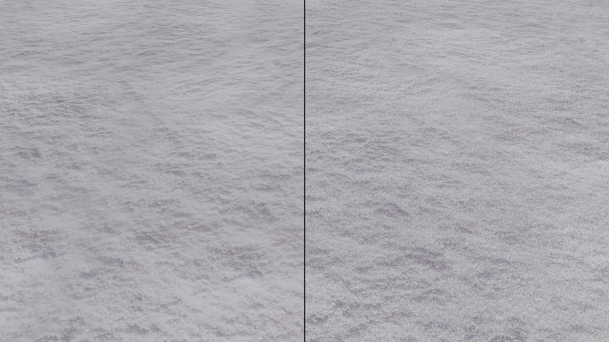

# Realtime lints
implementation of the paper ["Real-Time Rendering of Glinty Appearances using Distributed Binomial Laws on Anisotropic Grids"](https://ggx-research.github.io/publication/2023/06/09/publication-glints.html)

